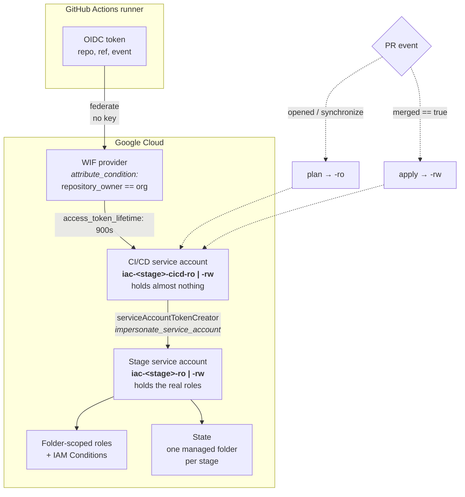

# FAST and GitHub Actions: how a pipeline gets authority

How a FAST stage is applied from CI without holding a credential, and why the roles it uses are
scoped the way they are. Read this before adding a stage, adding a repository, or granting anything
to a CI/CD service account.

Verified against `v56.1.0`. Re-verify at your own pinned release — see
[the one rule](../SKILL.md#the-one-rule).

## Why this is per-stage at all

The stage model already decides it. Stages are *"modeled around the security boundaries that
typically appear in mature organizations"*, which *"allows delegating ownership of each stage to the
team responsible for the types of resources it manages"* (`fast/README.md`). A boundary that exists
in the IAM model but not in the pipeline is not a boundary — so each stage gets its own identities,
its own state, and its own workflow. The pipeline is the enforcement of the stage split, not a
convenience on top of it.

This is also why *"FAST also aims to minimize the number of permissions granted to principals"*
(same source) shows up as structure rather than as discipline: the roles are attached to folders and
conditioned, so a stage cannot exceed its boundary even if its code tries to.

## The chain

Nothing in this path is a stored credential.



**1. GitHub mints an OIDC token.** The workflow declares `permissions: id-token: write`. No secret
is involved; the token is issued by GitHub and describes the repository, ref and event.

**2. The WIF provider accepts it, conditionally.** The provider is declared in stage 0's `iac-0`
project YAML under `workload_identity_pools`, with an `attribute_condition`. Upstream's hardened
dataset ships the block **commented out**, as a sample rather than a default:

```yaml
#         attribute_condition: attribute.repository_owner=="myorg"
#         identity_provider:
#           oidc:
#             template: github
```
— `fast/stages/0-org-setup/datasets/hardened/projects/core/iac-0.yaml`

Uncommented and pointed at a real organisation, this rejects tokens from outside it before any
Google identity is involved. Because it ships disabled, **verify it is set in the landing zone you
are in** — an absent or over-broad condition is the difference between "only our org can federate"
and "any GitHub repository can try".

**3. It federates into a CI/CD service account** (`google-github-actions/auth`), with
`access_token_lifetime: 900s`. This account is deliberately near-powerless.

**4. That account impersonates the stage service account.** This is the step that carries the
design. The generated providers file sets `impersonate_service_account` on both the backend and the
providers:

```hcl
terraform {
  backend "gcs" {
    bucket                      = "${bucket}"
    impersonate_service_account = "${service_account}"
  }
}
provider "google" {
  impersonate_service_account = "${service_account}"
}
```
— `fast/stages/2-project-factory/assets/providers.tf.tpl`

The CI/CD account is granted `roles/iam.workloadIdentityUser` and
`roles/iam.serviceAccountTokenCreator` **on its stage counterpart only**. So the identity reachable
from GitHub can do exactly one thing: become one specific stage account.

**5. The stage account's roles live on folders, not on the account.** Grants are attached at folder
scope, so scope — not trust — is what limits the blast radius.

## Why "no secrets" is true, and the one place it is not

True, in the parts that matter:

- No service account keys. Org policy in the hardened dataset enforces this
  (`iam.disableServiceAccountKeyCreation`, `…KeyUpload`), so a key-based pipeline is not merely
  discouraged, it cannot be created.
- No long-lived cloud credential in GitHub. The only inbound trust is the WIF provider's
  `attribute_condition`, and the resulting token expires in 15 minutes.
- Nothing to rotate, leak or copy between environments.

**The exception: `CICD_MODULES_KEY`.** The generated workflow contains, unconditionally:

```yaml
      # set up SSH key authentication to the modules repository
      - id: ssh-config
        name: Configure SSH authentication
        run: |
          ssh-agent -a "$SSH_AUTH_SOCK" > /dev/null
          ssh-add - <<< "${{ secrets.CICD_MODULES_KEY }}"
```
— `fast/stages/0-org-setup/assets/workflow-github.yaml`

This exists for the **private modules repository** case only. `fast/extras/0-cicd-github` states the
condition plainly: with no key options set *"it's assumed modules will be fetched from a public
repository. If modules repository authentication is needed the `key_config` attribute also needs to
be set."*

The trap: **the step has no `if:` guard**, and the workflow runs under `bash -e`. If modules are
sourced over public HTTPS — `source = "git::https://github.com/GoogleCloudPlatform/cloud-foundation-fabric.git//modules/…?ref=…"` —
the secret is unnecessary, but leaving it unset makes `ssh-add` fail on empty input and aborts the
job before any Terraform runs. So a public-modules installation is pushed into setting a secret that
authenticates nothing, purely to keep the step from failing.

If you find such a key, do not assume it grants access. Check the loaded identity in the step log:

```
Identity added: (stdin) (dummy-not-used-https)
```

That is a placeholder, and naming it so is the correct handling — an unused credential that looks
real is worse than one that announces itself. What it is *not* is evidence that the pipeline depends
on a secret. Confirm which case you are in by checking the module `source` protocol before treating
`CICD_MODULES_KEY` as load-bearing.

## Why the roles are not dangerous

Four mechanisms, each independently checkable.

**Read and write are different identities, chosen by the git event.** `plan` runs as `-ro` on
`opened`/`synchronize`; `apply` runs as `-rw` and only under
`github.event.pull_request.merged == true`. Merge is the privilege boundary, so review is what
grants write, and a push to a branch cannot apply anything.

**Roles are folder-scoped per stage.** The project-factory identity holds project-creation rights on
the workload folder; the security identity holds `roles/cloudkms.admin` on the security folder. A
stage cannot act outside its folder because it was never granted anything there — no policy check is
required for it to fail.

**IAM Conditions narrow even the necessary grants.** Where one stage must let another act on its
resources, the grant is conditioned to the single role that may be delegated. Upstream's security
project grants the project factory's identity `cloudkms.admin` — but only to hand out one role:

```yaml
iam_bindings:
  key_delegated:
    members:
      - $iam_principals:service_accounts/iac-0/iac-pf-rw
    role: roles/cloudkms.admin
    condition:
      title: Delegated IAM grant on keys.
      expression: |
        api.getAttribute(
          'iam.googleapis.com/modifiedGrantsByRole', [])
          .hasOnly(['roles/cloudkms.cryptoKeyEncrypterDecrypter']
        )
```
— `fast/stages/2-security/datasets/classic/projects/dev-sec-core-0.yaml`

An admin role that can grant roles is privilege escalation if left unconditioned — it can grant
anything, including to itself. `hasOnly` reduces it to exactly one. The same shape applies to
`roles/resourcemanager.projectIamAdmin` where a stage must set IAM on projects it does not own, and
an implementation may attach it at folder rather than project scope; check which you are looking at
before copying. This is the pattern behind *"managing GCP service usage through delegated role
grants"* cited in the skill's references, and it is the single most important thing to copy
correctly.

**State is partitioned.** Each stage gets its own managed folder inside the shared state bucket,
with `storage.admin` for its `-rw` identity and a viewer role for `-ro`. One stage cannot read or
corrupt another's state.

## Where the workflow file comes from

It is **generated**, and that is why it must not be hand-edited.

Stage 0 renders `assets/workflow-github.yaml` per entry in its `cicd.yaml` dataset and publishes the
result. Each entry names the repository, the branches on which apply is allowed, the provider files,
the tfvars the stage needs, the two service accounts, and the WIF pool and provider:

```yaml
<stage-key>:
  provider_files:
    apply: <stage>-providers.tf
    plan: <stage>-ro-providers.tf
  repository:
    name: <org>/<repo>
    type: github
    apply_branches: [main]
  service_accounts:
    apply: $iam_principals:service_accounts/iac-0/iac-<stage>-cicd-rw
    plan: $iam_principals:service_accounts/iac-0/iac-<stage>-cicd-ro
  tfvars_files: [...]
  workload_identity:
    pool: $workload_identity_pools:iac-0/default
    provider: $workload_identity_providers:iac-0/default/github-default
    iam_principalsets:
      template: github
```

So a workflow is configurable — at its source. Editing the rendered file in the stage repository is
the same mistake as editing generated tfvars: it works until the next render, and the reason for the
change is lost. Change `cicd.yaml`.

Two consequences follow, and both are commonly missed:

- **A new stage needs three things, not one.** Its `-cicd-ro`/`-cicd-rw` service accounts in stage
  0's `iac-0` project YAML, with `workloadIdentityUser` and `serviceAccountTokenCreator` on the
  stage accounts; a managed folder in the state bucket; and an entry in `cicd.yaml`. Missing the
  first is easy to overlook, because the stage will have a runtime identity and state and still be
  unable to run from a pipeline.
- **The CI/CD variable has no default.** Stage 0's README names the file `cicd-workflows.yaml`; the
  shipped file is `cicd.yaml`, and unset means **no workflows are rendered at all** rather than
  default ones. See [the contradictions section](../SKILL.md#the-upstream-documentation-contradicts-itself).

## What this does not cover

**Tenants.** Everything above is stage machinery. The project factory generates provider and tfvars
files for the projects it creates, but no workflow and no repository — upstream states the output
files *"will be used in future releases to configure project-level CI/CD from this factory."* Stage
0's CI/CD factory is documented as covering *"this and subsequent stages"*. A tenant repository
therefore has no documented onboarding path to a pipeline at this release.

**Repository creation.** `fast/extras/0-cicd-github` can create repositories, set Actions secrets and
deploy keys, and commit initial files — but it is explicitly *"only meant as a one-shot solution with
perishable state"*, and it needs a GitHub token *"with organization-level permissions"* in
`GITHUB_TOKEN`. Note the asymmetry: the steady-state pipeline holds no credential, while the
bootstrap helper needs a broadly-scoped one. Treat it as a one-time bootstrap run by a human, not as
part of the running system.

## Checklist before granting anything to a pipeline identity

1. Is the grant on the **CI/CD** account or the **stage** account? The CI/CD account should hold
   nothing but impersonation of its own stage account.
2. Is it attached at **folder** scope rather than organization scope?
3. If it can grant roles to others (`*IamAdmin`), is it conditioned with `hasOnly([...])`?
4. Does the `-ro` identity have any write role? It should not — it is what runs on every PR.
5. Can apply be reached without a merge? Check `apply_branches` and the `merged == true` guard.
6. Is a new secret genuinely needed, or is it the `CICD_MODULES_KEY` shape — a step that must not
   fail rather than an authorisation?

## Sources

All at `v56.1.0` unless noted, read 2026-08-16.

- `fast/README.md` — guiding principles, security-first design
- `fast/stages/README.md` — stage contracts and forward-only data flow
- `fast/stages/0-org-setup/assets/workflow-github.yaml` — the rendered workflow template
- `fast/stages/0-org-setup/cicd-workflows.tf`, `cicd-workflows-preconditions.tf`,
  `schemas/cicd-workflows.schema.json`, `datasets/classic/cicd.yaml` — the CI/CD factory
- `fast/stages/0-org-setup/datasets/hardened/projects/core/iac-0.yaml` — CI/CD service accounts, the
  commented WIF provider sample
- `fast/stages/0-org-setup/datasets/hardened/organization/org-policies/iam.yaml` —
  `iam.disableServiceAccountKeyCreation` and `…KeyUpload`, both `enforce: true`
- `fast/stages/2-security/datasets/classic/projects/dev-sec-core-0.yaml` — the `hasOnly` delegated grant
- `fast/stages/2-project-factory/assets/providers.tf.tpl` — the impersonation indirection
- `fast/extras/0-cicd-github/README.md` — modules key, public vs private modules, one-shot caveat
- [Managing GCP service usage through delegated role grants](https://medium.com/google-cloud/managing-gcp-service-usage-through-delegated-role-grants-a843610f2226)
- [Workload Identity Federation](https://cloud.google.com/iam/docs/workload-identity-federation) ·
  [IAM Conditions](https://cloud.google.com/iam/docs/conditions-overview)
